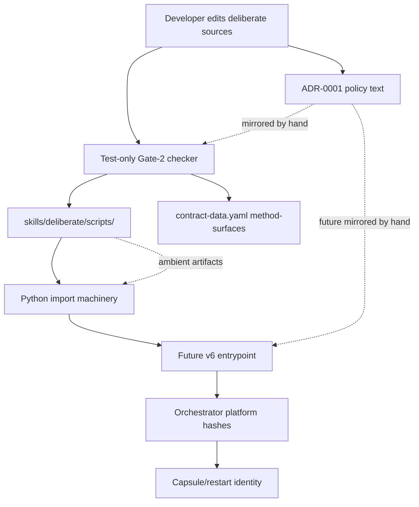
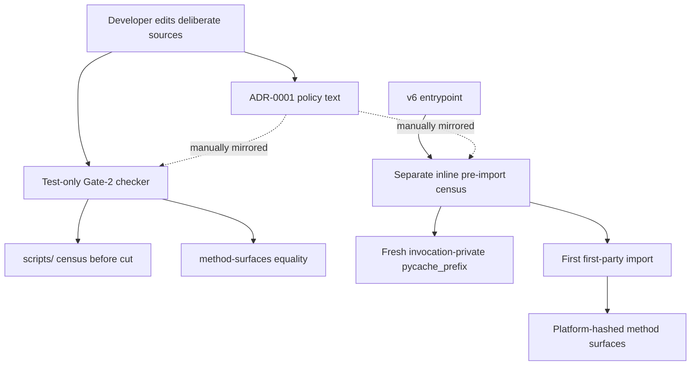
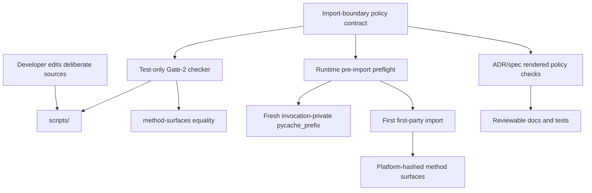

# Security Hardening Proposal: Own the deliberate import-execution boundary as one explicit control

## Decision

We need to decide how the v6 modularization should preserve the security invariant that no unauthenticated Python code can execute from `skills/deliberate/scripts/` before the method-surface identity has been established. The immediate branch closes the known Gate-2 bypasses, but the next cut still has to carry the same boundary into runtime code before the first production import.

I recommend Option 2, "Single-source the boundary policy contract," under the current constraints. It preserves the current direct per-file model and the small first extraction, while making drift between ADR prose, the authoring checker, and the future runtime preflight harder to introduce.

## Executive Recommendation

The option set is intentionally small:

| Option | Title | Short read |
| --- | --- | --- |
| Option 1 | Finish the duplicated gate/runtime pair | Keep the current checker and implement a separate matching runtime preflight in the v6 entrypoint. |
| Option 2 | Single-source the boundary policy contract | Declare the import-boundary policy once and mechanically verify or generate both the authoring checker and runtime preflight from it. |
| Option 3 | Run from a launcher-prepared clean module root | Move execution into a prepared clean root so the runtime sees only authenticated source files and an invocation-private cache. |

We can safely treat Option 1 as the baseline because it is exactly where ADR-0001 now points: the authoring gate is hardened, and the future entrypoint must mirror it before importing first-party modules. What gives me pause is that the recent failures were not one missed spelling; they were a pattern of policy surface area expanding as Python's loader behavior came into view. Option 2 is the smallest design that addresses that pattern. Option 3 is stronger isolation, but it asks us to change launch topology at the same time as module topology, which is probably too much for the first v6 cut unless we see another escape.

## Evidence

| Evidence | Finding or document | What it establishes |
| --- | --- | --- |
| `E001` | User-supplied closure summary | Reports the verified `.zip` plus `zipimport.zipimporter(...).load_module(...)` bypass, the disguised `payload.dat` zip path-hook bypass, the repair at `288e4ca`, and the final verification table. |
| `E002` | Branch handoff for zipimport closure | Records the branch state, the clean re-review claim, the two-commit repair range, the residual risks, and the next landing decision. |
| `E003` | ADR-0001 module authentication boundary | Defines the desired direct per-file method-surface model, Gate 2, runtime pre-import census, fresh cache-prefix rule, and accepted residuals. |
| `E004` | Gate-2 import-closure checker | Shows the current non-executing authoring checker: recursive census, zip suffix and magic checks, positional identifier ban, first-party import classification, and closure/inventory/on-disk equality. |
| `E005` | Gate-2 regression tests | Shows the expected negative and positive cases, including sourceless bytecode, symlinks, packages, dynamic import aliases, zip archives, disguised zip archives, and false-positive controls. |
| `E006` | Gate-1 dual-path layout smoke | Establishes that bytecode can silently impersonate source, that a fresh cache prefix helps only for generated/read-through-cache bytecode, and that interpreter selection can vary across invocation forms. |
| `E007` | Current method-surface inventory | Shows that the production validator is still a single Python surface at `contract-data-version: 5`, so runtime modularization has not started. |

Observed claims: `E004` and `E005` show the branch has a non-executing authoring checker and regression cases for the newly identified artifact and dynamic import paths. `E003` shows the runtime pre-import census is required but not yet implemented. `E006` shows the bytecode hazard is real and that a prefix by itself is not the whole boundary. Inferred claim: the highest-leverage hardening opportunity is policy ownership, because the same invariant must be preserved by at least three consumers that can otherwise drift.

I inspected `docs/adr/0001-authenticate-deliberate-modules-as-direct-method-surfaces.md`, `skills/deliberate/tests/check_import_closure.py`, `skills/deliberate/tests/test_import_closure.py`, `docs/smoke-tests/2026-07-15_deliberate-gate1-dual-path-layout-spike.md`, and `skills/deliberate/references/contract-data.yaml` on the current branch. I did not rerun the proof ladder while writing this proposal.

## Current Design And Failure Mode

The current design has a clear intended invariant: before modularized `deliberate` code runs, every behavior-bearing Python file under `scripts/` must be known, inventoried, platform-hashed, and protected from stale or alternate loader forms. ADR-0001 deliberately rejects aggregate identity and chooses direct per-file inclusion in `validation.method-surfaces`. That is a good fit for the existing capsule and restart-frontier model because a drifted file remains attributable to a concrete locator.

The failure mode is that Python's import surface is larger than regular `.py` files and ordinary `import` statements. The evidence shows the control had to grow from simple closure equality to a complete scripts census: sourceless `.pyc`, `__pycache__`, extension suffixes, symlinked packages, package directories, zip archives by suffix, zip archives by content signature, and dynamic import or code-execution names all matter. The disguised zip bypass is especially instructive. Once we narrow the identifier ban to avoid false positives, the census becomes the security burden-holder; if the census misses one loadable artifact, the narrowed ban is no longer sound.

We should separate the tactical status from the structural condition. The tactical branch appears to close the known authoring-gate holes. The structural condition is that the policy is now complex enough that copying it from ADR prose into a test-only checker and then later into runtime preflight code is itself a security risk. The future runtime pre-import census is the riskiest consumer because it must run before first-party import, so it cannot casually import the test checker that currently embodies the policy.

## Desired Invariants

- Before any first-party production import, runtime execution refuses to proceed if `scripts/` contains any unexpected loadable artifact, symlink, cache, package, archive, nested Python file, or nonconforming module form.
- The authoring checker and runtime preflight enforce the same boundary policy, and drift between them is mechanically visible before a v6 cut lands.
- Every production Python file that can execute from `scripts/` is directly represented in `validation.method-surfaces` and platform-hashed before helper execution.
- Cache freshness is invocation-private: no helper invocation can read repo-local bytecode or reuse a previous invocation's redirected bytecode.
- Benign source patterns, such as ordinary `re.compile`, method names, docstrings, and inert non-archive files, stay legal so developers do not learn to route around a noisy gate.
- The accepted residual remains explicit: reflection or computed-string gadgets and external code reached outside `scripts/` are not silently claimed as solved by this boundary.

## Constraints And Non-Goals

The first v6 extraction should stay reviewable and preserve the direct per-file authentication model. Test-only harnesses should not become authenticated production inputs. We need both canonical in-place and Claude symlink delivery paths. We do not have measured performance or memory budgets, and we should not introduce a launcher, generator, or sandbox unless it buys down a real recurrence risk. This proposal does not attempt to prove the current branch's tests, replace the tactical fix, or broaden the boundary to all external `sys.path` manipulation.

## Before Architecture

The before view shows the security-relevant ownership split. The authoring checker is outside `method-surfaces`, the runtime preflight is still a future obligation, and the same policy is carried by ADR prose plus hand-maintained code.



| Change | Before | After | Security consequence | Cost |
| --- | --- | --- | --- | --- |
| Policy ownership | ADR prose plus checker implementation plus future entrypoint obligation | Depends on selected option | Current split can drift as loader cases expand | Current approach has low immediate cost but recurring review cost |
| Runtime pre-import control | Required by ADR but not implemented | Depends on selected option | Runtime remains a future trust boundary, not observed behavior | Any option must add runtime work before the physical v6 extraction |
| Loader artifact model | Encoded in checker code and tests | Depends on selected option | Known authoring bypasses are covered on the branch; future drift remains the concern | Keeping it correct requires repeated adversarial review |

The diagram is not a claim that runtime modularization already exists. It shows why the next implementation step is sensitive: the first production import will cross from source files into Python loader behavior, and that boundary must already be clean.

## Options

### Option 1: Finish the duplicated gate/runtime pair

Option 1 keeps the shape ADR-0001 currently describes. We retain `skills/deliberate/tests/check_import_closure.py` as the authoring gate and implement a separate runtime pre-import census directly in the v6 entrypoint before any first-party import. The runtime code also sets a fresh invocation-private `sys.pycache_prefix`, refuses repo-local bytecode and unexpected artifacts, and records the effective interpreter in smoke evidence.

The strongest case for this option is delivery control. We can land the current branch, then implement only the runtime obligations needed for the first physical extraction. That keeps the first v6 cut small: no generator, no new contract section, no new launcher topology. The tactical protections from `E004` and `E005` remain useful because the authoring gate can catch bad layouts before runtime.

The residual risk is drift. We would have two independently maintained implementations of a policy that already grew through adversarial review. The runtime version cannot simply import the test checker because the checker is deliberately outside `method-surfaces`, and importing a first-party policy module before the census would cross the boundary we are trying to enforce. We can reduce this risk with copy-focused tests, but we should be honest that duplicate code is the design.



| Change | Before | After | Security consequence | Cost |
| --- | --- | --- | --- | --- |
| Runtime census | Required but absent | Inline pre-import census in entrypoint | Known artifact classes can be refused before first import | Duplicates checker policy |
| Cache freshness | ADR requirement only | Entry point creates and retires fresh prefix | Reduces stale bytecode impersonation risk | Adds lifecycle code and cleanup tests |
| Drift control | Review discipline and tests | Review discipline plus matched regression cases | Helps, but does not remove policy drift | Lowest implementation cost |

This option is credible if we want the first v6 cut to be mostly about extracting `_deliberate_shared.py`. I would be comfortable with it only if the runtime preflight gets exact negative tests for the same artifact classes as the checker, including the disguised zip and sourceless `.pyc` cases, and if the duplicated policy is called out as intentional debt with a follow-up owner.

### Option 2: Single-source the boundary policy contract

Option 2 keeps enforcement local but makes the policy itself a first-class contract. Instead of relying on ADR prose as the only shared source, we add a machine-readable import-boundary section, likely in `contract-data.yaml` or a tightly adjacent reference, that declares allowed production module names, allowed data directories, forbidden loader suffix families, archive signatures, banned identifiers, and the runtime cache invariants. The authoring checker and runtime preflight either generate their rule tables from that contract or emit mechanically checked renderings from it. The runtime still uses inline pre-import code where necessary, but the policy values and coverage expectations are not hand-copied.

The attractive part is that this matches the shape of `deliberate` itself. `E007` already shows `contract-data.yaml` is the machine-readable authority for schema and method identity. We can extend that pattern to the import boundary without changing the authentication model. The authoring checker remains outside `method-surfaces`, but it no longer becomes the sole source of policy truth. The runtime entrypoint can carry a minimal pre-import implementation while tests prove its embedded policy rendering matches the contract data.

The risk is that we add contract machinery before the first extraction. That is not free. A clumsy version could become a second abstraction as heavy as the aggregate identity ADR-0001 rejected. To keep Option 2 proportionate, the policy contract should be small and declarative. It should not try to model all of Python import semantics. It should declare the accepted allowlist and denylist values we already rely on: flat `_deliberate_<domain>.py`, allowed `fixtures/` data, zip magic values, forbidden suffix categories, banned positional identifiers, and cache-prefix obligations.



| Change | Before | After | Security consequence | Cost |
| --- | --- | --- | --- | --- |
| Policy ownership | ADR prose and checker code | Declarative policy contract feeds checker and runtime preflight | Drift becomes mechanically detectable before v6 lands | Adds a small contract surface and rendering/check tests |
| Runtime implementation | Future handwritten mirror | Inline pre-import logic with contract-derived constants or checked rendering | Runtime keeps pre-import safety without importing the test checker | Some duplication remains at algorithm level |
| Review posture | Adversarial review reads policy in prose and code | Reviewers can compare one policy source to both consumers | Makes future bypass-class additions harder to miss | Requires discipline to keep the contract small |

This option does not eliminate every duplicate line, and that is acceptable. The security win is not aesthetic reuse; it is preventing the authoring and runtime consumers from silently disagreeing on which artifacts are forbidden. If a future review adds another loader artifact, we update the policy contract once and the mismatch tests fail until both consumers reflect it.

### Option 3: Run from a launcher-prepared clean module root

Option 3 moves the strongest boundary earlier. A launcher prepares an invocation-private execution root containing only authenticated source files and declared data, sets the cache prefix inside that invocation root or another fresh temp location, and runs the validator from that prepared root. The original `scripts/` directory becomes an input to staging rather than the directory Python imports from.

The strongest case for this option is containment. If Python only sees the staged root, a stray `.pyc`, symlinked package, zip archive, or local shadow file in the source tree cannot be reached by ordinary import resolution. The launcher can refuse unexpected source-tree artifacts before staging and then run with a clean import path. This design also gives us a sharper rollback story for bytecode: the whole invocation root is disposable.

The concern is scope. We would be changing launch topology, path identity, cache identity, and module topology at the same time. `E006` already shows path and interpreter details can vary across invocation forms, so a staging launcher would need careful dual-path proof before it becomes less risky than the problem it solves. It may also complicate capsule method identity if runtime evidence now references staged paths while the authoritative surfaces live in the source tree.

```mermaid
flowchart TD
  Source["Authenticated source tree"] --> Launcher["Boundary launcher"]
  Contract["method-surfaces and import policy"] --> Launcher
  Launcher --> Census["Refuse unexpected source artifacts"]
  Census --> Stage["Invocation-private clean root"]
  Stage --> Cache["Fresh cache prefix"]
  Cache --> Runtime["Validator runs from staged root"]
  Runtime --> Capsule["Capsule/restart identity records source surfaces"]
  Source -. not on runtime sys.path .-> Runtime
```

| Change | Before | After | Security consequence | Cost |
| --- | --- | --- | --- | --- |
| Import root | Runtime imports from served `scripts/` | Runtime imports from clean staged root | Ambient source-tree artifacts are not import-visible | New launcher and path-mapping proof |
| Failure containment | Refuse in place | Refuse before staging or discard staged root | Stronger cleanup and rollback boundary | More moving pieces in every invocation |
| Capsule/source identity | Source path equals runtime path | Runtime path is staged, source path remains authoritative | Needs explicit source-to-stage identity mapping | Higher compatibility and review burden |

I would not choose Option 3 for the immediate first module extraction. It becomes preferable if we see another bypass that depends on ambient Python import behavior despite a synchronized policy contract, or if future module count makes repeated in-place census and path reasoning too fragile.

## Comparison

| Dimension | Option 1: Duplicated pair | Option 2: Policy contract | Option 3: Clean module root |
| --- | --- | --- | --- |
| Security | Improves known runtime coverage but leaves policy drift as a live risk. | Improves known coverage and makes drift between consumers mechanically visible. | Strongest containment because ambient source-tree artifacts are removed from runtime import visibility. |
| Performance | Likely near-neutral; runtime census is filesystem traversal before invocation. | Likely near-neutral; same census plus small contract/rendering checks outside hot path. | Unknown to regressive; staging may add file copies or mapping work per invocation. |
| Memory | Neutral; bounded path and metadata sets. | Neutral to slight increase in test/render metadata. | Unknown to slight increase; staged roots and process/temp state retain more files during invocation. |
| Reliability | Improves fail-closed behavior but duplicate implementations can diverge. | Improves fail-closed behavior and gives clearer drift failures. | Improves cleanup isolation but adds launcher failure modes. |
| Operability | Low new burden; failures look like current checker/runtime refusals. | Moderate but manageable; failures can point to policy/consumer mismatch. | Higher burden; incidents now include staging, path mapping, and launcher diagnostics. |
| Migration | Smallest change; easiest rollback. | Moderate change; still compatible with direct per-file identity. | Largest change; requires new dual-path and capsule path proof. |

All three options preserve the tactical branch work. The main difference is where we want to pay complexity: in future review discipline, in a small policy contract, or in a stronger execution topology.

## Recommendation

I recommend Option 2 under the current constraints. It is the best match for what the evidence taught us: the danger is not only one bypass class, but the tendency for a loader-boundary policy to sprawl across prose, checker code, tests, and future runtime code. A small declarative policy contract lets us keep the v6 cut incremental while giving reviewers a concrete way to ask, "Do both consumers enforce the same boundary?"

Option 1 should win if the immediate priority is to land the smallest possible v6 extraction and accept a follow-up drift-reduction task. Option 3 should win if future review finds that in-place runtime import control remains fragile even after policy synchronization, or if a larger isolation milestone becomes acceptable.

## Evidence Coverage And Residual Risk

| Evidence | Option 1 effect | Option 2 effect | Option 3 effect | Tactical fix still required |
| --- | --- | --- | --- | --- |
| `E001` - User-supplied closure summary | Mitigates recurrence if runtime duplicates all fixed cases. | Addresses drift risk around the reported bypass classes by single-sourcing policy values. | Mitigates by making source-tree zip artifacts non-import-visible after staging. | Yes, keep the current branch fixes and tests. |
| `E002` - Branch handoff for zipimport closure | Mitigates the handoff's next runtime-census concern. | Addresses the handoff's concern more directly by preventing policy divergence. | Mitigates with stronger containment but expands scope. | Yes, land or preserve the branch before v6 extraction. |
| `E003` - ADR-0001 module authentication boundary | Implements the ADR as written. | Refines the ADR into a machine-checkable policy source without changing the direct per-file decision. | Partially changes the runtime shape and would need ADR amendment. | Yes, ADR remains authority until amended. |
| `E004` - Gate-2 import-closure checker | Keeps checker as separate authoring control. | Keeps checker but binds it to shared policy. | Keeps checker as source-tree admission control before staging. | Yes, checker remains useful in every option. |
| `E005` - Gate-2 regression tests | Reuse tests and add runtime duplicates. | Reuse tests and add policy-consumer mismatch tests. | Reuse tests plus launcher/staging tests. | Yes, keep negative and benign controls. |
| `E006` - Gate-1 dual-path layout smoke | Requires new runtime smoke for cache prefix and bytecode refusal. | Same, plus policy-render smoke. | Requires broader dual-path staging smoke and path identity checks. | Yes, bytecode and interpreter evidence must be refreshed. |
| `E007` - Current method-surface inventory | v6 bumps inventory when module extraction starts. | v6 bumps inventory and likely adds policy-render checks. | v6 may need new launcher or staged-root surface decisions. | Yes, contract-data versioning remains required. |

Residual risks remain in every option. Reflection or computed-string gadgets can still be statically hard to detect; ADR-0001 accepts that residual and relies on the scripts census to remove local Python artifacts those gadgets could reach. Native-code loaders and external code outside `scripts/` remain outside this gate. None of the options should be described as closing those residuals unless the boundary is explicitly broadened.

## Migration And Rollout

For Option 2, the rollout should preserve the existing branch fixes as the tactical floor. First, land or rebase the current Gate-2 branch and refresh the live source identity. Next, add the declarative policy contract and a check that the current authoring checker consumes or renders the same values. Then implement the runtime pre-import preflight for the first v6 module extraction with an explicit proof that the embedded or imported policy values match the contract before first-party import occurs. Finally, run the dual-path smoke through both canonical and Claude symlink paths, recording the effective interpreter.

Rollback is straightforward if we keep the policy contract additive until the runtime consumer exists: revert the policy-contract and runtime-preflight commits, retain the current Gate-2 checker, and keep v6 extraction blocked. During migration, the tactical checker should remain required; the structural work must not weaken the existing branch's negative cases.

## Validation Plan

- Re-run the current Gate-2 checker on the live tree and the full deliberate test suite before changing policy ownership.
- Add a policy-consumer mismatch test: remove one forbidden archive signature, loader suffix family, allowed directory, or banned identifier from either consumer and observe a deterministic failure.
- Add runtime pre-import tests for the exact classes represented in `E005`: sourceless `.pyc`, `__pycache__`, symlinked module, symlinked package, package directory, `.zip`, `.egg`, `.whl`, disguised zip magic, nested `.py`, shadowing local module, and benign inert files.
- Exercise both delivery paths for the future v6 entrypoint: canonical in-place and Claude symlink.
- Record effective interpreter, cache-prefix path, empty-prefix assertion, no repo-local bytecode assertion, and seeded direct `.pyc` refusal before first-party import.
- Benchmark representative helper startup latency before and after the runtime preflight. No target exists yet, so use current helper startup as baseline and set an explicit threshold before accepting any staging or launcher design.

## Implementation Work Packages

- Define the import-boundary policy contract with only values the checker and runtime truly need: module naming regex, allowed data directories, loader suffix families, archive suffixes, archive magic values, banned identifiers, and cache-prefix invariants.
- Wire or mechanically compare the Gate-2 authoring checker against that contract without importing production modules.
- Implement the v6 runtime pre-import preflight with the policy values embedded or rendered in a way that is checked against the contract before release.
- Add policy drift tests, runtime preflight negative tests, and dual-path smoke records.
- Preserve the existing tactical Gate-2 tests and mutation probes through the transition.

## Open Questions

- Should the policy contract live inside `contract-data.yaml`, which already owns method-surface validation, or in a smaller adjacent reference to avoid bloating the runtime data file?
- What is the smallest safe way to let runtime preflight use contract-derived values without importing first-party code before the census?
- Should Option 2 be part of the first v6 physical extraction, or should the branch land first and the policy-contract work become a separate pre-v6 gate?
- Is the accepted external `sys.path` residual still acceptable after the first module split, or should future ADR work add a static signal for source-tree `sys.path` mutation?
